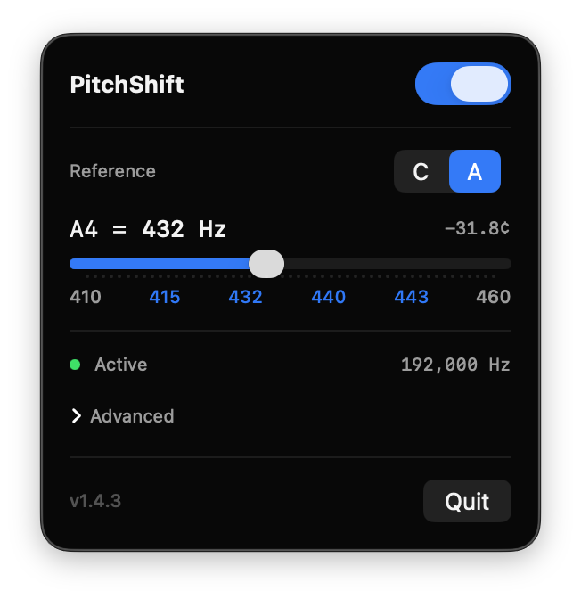

<p align="center">
  
</p>

<h1 align="center">PitchShift</h1>

<p align="center">
  <strong>Real-time system-wide pitch shifter for macOS</strong><br>
  Retune all audio output to 432 Hz, Baroque pitch, or any frequency — straight from the menu bar.
</p>

<p align="center">
  <a href="https://github.com/pc418/pitchshifter/releases/latest"></a>
  <a href="https://github.com/pc418/pitchshifter/releases/latest"></a>
  
  
  <a href="LICENSE"></a>
</p>

<p align="center">
  
</p>

---

## Why

Concert pitch A4 = 440 Hz was standardized in 1955, but for most of music history, tuning was lower. Baroque ensembles played at A = 415 Hz; Classical-era pitch hovered around 420–430 Hz. The modern push toward 440+ came from orchestral "brightness wars" — higher tuning sounds more brilliant in a concert hall, which audiences respond to, which pushes tuning even higher.

All recorded and streamed music today sits at 440 Hz or above. Some listeners find lower standards — Verdi's A = 432, scientific C = 256, historical Baroque pitch — warmer and more relaxing. PitchShift lets you retune everything on your Mac to hear it the way you want.

## Install

**Download** the latest `.zip` from [Releases](https://github.com/pc418/pitchshifter/releases/latest), unzip, and drag `pitchshift.app` to `/Applications`.

Or build from source:

```bash
git clone https://github.com/pc418/pitchshifter.git
cd pitchshifter
make build     # universal binary (arm64 + x86_64), ad-hoc codesigned
make run       # build + open
make install   # copy to /Applications
```

> Requires Xcode Command Line Tools and macOS 14.2+.

## Usage

PitchShift lives in the menu bar. Click the icon to open the panel:

- **Toggle** pitch shifting on/off
- **Switch reference** between A mode and C mode
- **Drag the slider** or tap a preset to set your frequency

| Preset | Frequency | Style |
|--------|-----------|-------|
| A4 = 415 Hz | Baroque pitch | Historical |
| A4 = 432 Hz | Verdi tuning | Alternative |
| A4 = 440 Hz | ISO standard | No shift |
| A4 = 443 Hz | European orchestral | Bright |
| C4 = 256 Hz | Scientific / Schiller | Alternative |

Settings persist across restarts. The app automatically follows your default output device — headphones, Bluetooth, external DAC — without interruption.

## How it works

```
Core Audio Tap → IOProc → RingBuffer → AVAudioSourceNode → AVAudioUnitTimePitch → Output
```

1. **System audio capture** — `CATapDescription` taps all system audio except the app itself (no feedback)
2. **Aggregate device** — pairs the tap with the physical output for a single IOProc capture path
3. **Ring buffer** — dual-channel, power-of-2, Accelerate-backed; bridges real-time IOProc to AVAudioEngine
4. **Pitch shift** — `AVAudioUnitTimePitch` at max quality (overlap 32, render quality 127), tempo-preserving
5. **Output** — routed to the active physical device

No virtual audio drivers, kernel extensions, or microphone access. Uses the Core Audio Tap API introduced in macOS 14.2.

## Advanced

The panel includes buffer size control under **Advanced**:

- **Auto** — selects a buffer giving ≥ 20 ms latency at the current sample rate
- **Manual** — pick 16 to 16384 frames (lower = less latency, higher = more stability)
- Per-sample-rate settings are remembered independently

## License

[Apache License 2.0](LICENSE)

---

<p align="center">
  <a href="https://ko-fi.com/F1F11WRQDT"></a>
</p>
